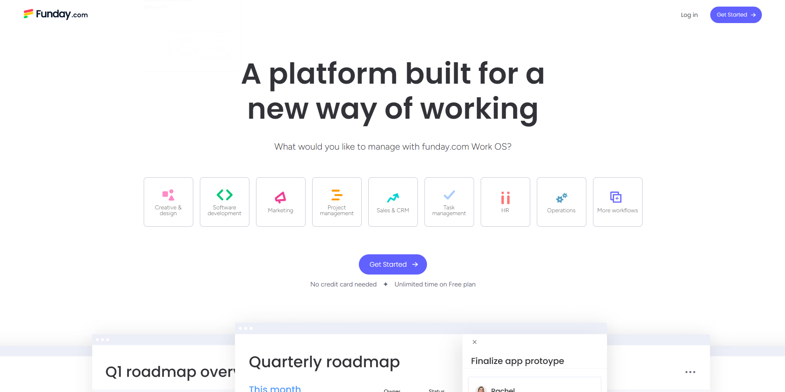
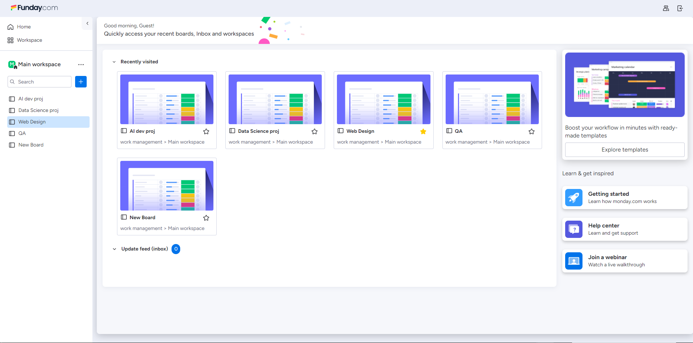

# Funday - pixel perfect, E2E clone of Monday (React + Node.js). 

Funday is a full stack web application inspired by Monday that replicates the core functionalities of Monday.

[Live demo here](https://funday-k1un.onrender.com/ "Funday link")
## This project is built using React, Redux, NodeJS, ExpressJS, MongoDB, SASS, and Sockets.


For those of you who are already familliar with Trello, we added some intersting and unique [features](#application-features).
If you are not familliar with the App, read about it [here](#trello-description).
And if you are tired and just want to see some images of the website, [scroll to the bottom...](#showcase)


___

### Table of Contents
- [Funday Description](#funday-description)
- [Application Features](#application-features)
- [Technologies](#technologies)
- [Getting started](#getting-started)
- [Showcase](#showcase)

## Funday Description
Funday is an app in which you can manage projects and tasks using boards. A board contains groups and tasks. Usually each project is a board, and the gro and cards are the tasks and subjects to do in the project. Users can modify the board and change list and card locations using Drag and Drop.
Users can work together and watch live changes. 
There are many other features in Funday, such as labels, due date for tasks, members and more. 
We added AI helper with voice recording so you can record a task and get it broken into smaller tasks by chatGPT. 
More about it in the [features section](#application-features).

## Application Features
- Create ***Boards*** and manage projects: Using ***D&D***, create, remove, and update lists and tasks.
- Create, edit and archive ***Task*** to the deepest level: Labels, Due date, Members, Cover images, Checklists, Activity log, Copy, Move and Archive.
- ***Side Menu:*** - Change the background of the board with the ***Unsplash Photo API***, ***Filtering*** by members / labels and General ***Activity*** Log!
- Google Login, along with regular authentication which is encrypted and safe.

In addition, we created Blind Color Mode, in which you can recognize the labels and cover colors by signs.
We have added a voice assistant which can accept vocal commands and help manage products with no effort! For example, you can filter, create board and more.
Of course that we included all the small nuances Trello has. You are not supposed to find any differences! 

## Technologies

The technology stack we used was MERN - MongoDB, Express, React, Node.js.
The app uses webSockets to update the board in real-time.
The API calls to the backend are done with the REST API method , and we used middlewares to authenticate and authorize actions.

We have used many thirs side libraries for many goals, such as the cloudinary, monday-ui-style ,react-particles-js, D&D and more.
The layout and pixel-perfect were made with SASS (functions, mixins, variables). 

## Getting started

Head to the repository on top and clone the project or download the files.

```
git clone https://github.com/galbarcessat/funday.git
git clone https://github.com/galbarcessat/funday-backend.git
```

Enter the backend folder and make sure you have node_modules installed. After that we will initiate the server with 'npm start':

```
npm i 
npm start
```

You should get a console ouput that the server is up and running at port 3030.
Enter the frontend folder and repeat the same process.

```
npm i 
npm run dev
```

You shuold get a console ouput that the server is up and running at localhost:5173.

That's it! The App should be opened automatically, enjoy!

## Showcase

### Homepage
The landing page in which the user can sign up / login, or press the call to action button to start demo if the are limited with time.



### Workspace
All of the user's boards. Here, in addition to create a board with the empty board box and navigate between their's boards, they are able to use the vocal-assistant we created with 3rd side library! Pressing on the button in the middle of the nav bar on top would open an modal with instructions that makes life a bit easier.



### Board
All the functionality that you have in Monday. D&D, live-updates, editing tasks to the deepest level, side-menu, editing board members and much more - just [check it out...!](https://skello-deploy.onrender.com "Skello link")


### Signup
We created an e2e authentication flow, including encrypting the users' details, middlewears.


### Task details
Here the user can edit their tasks and to watch it happens live, in this page and behind. Every button on the right menu opens an dynamic modal which fits the content accordingly to the pressed button.


### Side menu
The menu on the right which is opened by the pressing the "Show menu" button enables the user to filter members by labels / name, change the board background with unsplash Images, watch the archived tasks (and bring it back to the board) and watch the activity of the board (who did what and when, and to navigate to those tasks).


### Some mobile!
Just a taste of the mobile experience. We used different **mixins** and **conditional rendering**. 

### Authors
 - [Gal Ben Natan](https://github.com/OriBenAmram)
 - [Nati Feldbaum](https://github.com/DanielShaked)
 - [Omer Vered](https://github.com/yuvalshai95)
